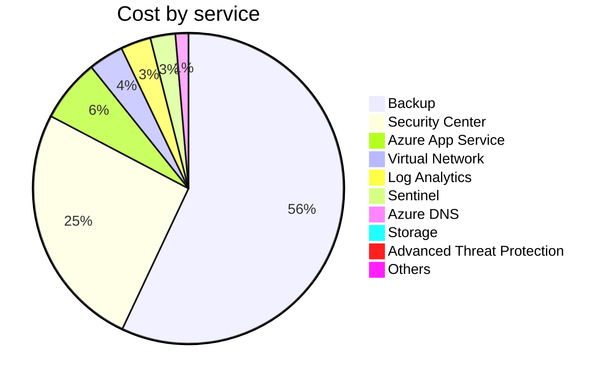
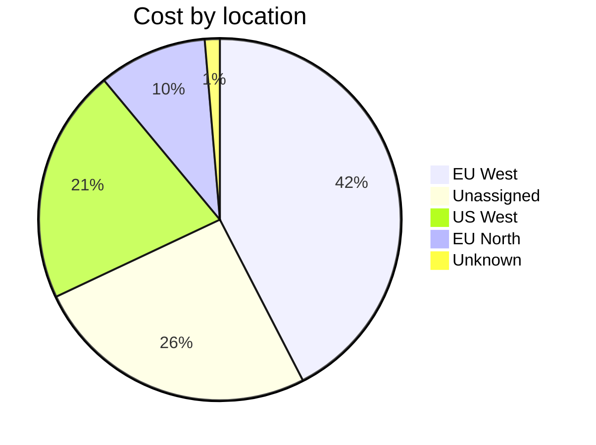
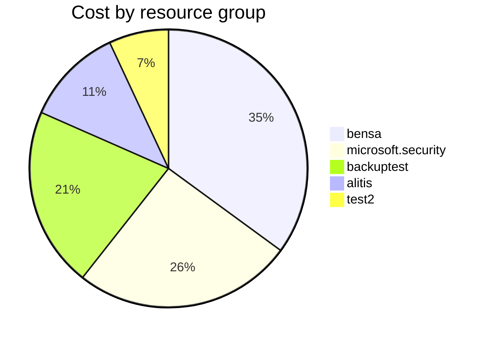

# Azure-Cost-CLI is a new tool to get cost information from Azure. [Link](https://github.com/mivano/azure-cost-cli){: .btn }

###  What are the benefits of this tool?, Simple, you can get cost information from Azure without having to log in to the portal. ? Send teams messages with cost information. ? Send emails with cost information. ?

# Azure Cost Overview

<blockquote class="white">
Accumulated cost for subscription id `0692777c-ed93-4a6a-85c7-144c24xxxx` from **1.5.2023** to **9.5.2023**
</blockquote>

## Totals

|Period|Amount|
|---|---:|
|Today|0,90 EUR|
|Yesterday|2,21 EUR|
|Last 7 days|17,26 EUR|
|Last 30 days|19,40 EUR|

```mermaid
gantt
   title Accumulated cost
   dateFormat  X
   axisFormat %s
   section 01 maí
   EUR 2,14 :0, 214
   section 02 maí
   EUR 4,24 :0, 424
   section 03 maí
   EUR 6,37 :0, 637
   section 04 maí
   EUR 8,51 :0, 851
   section 05 maí
   EUR 11,00 :0, 1100
   section 06 maí
   EUR 13,61 :0, 1361
   section 07 maí
   EUR 16,29 :0, 1629
   section 08 maí
   EUR 18,50 :0, 1850
   section 09 maí
   EUR 19,40 :0, 1940
   section 10 maí
   EUR 21,36 : done, 0, 2136
   section 11 maí
   EUR 23,33 : done, 0, 2333
   section 12 maí
   EUR 25,52 : done, 0, 2552
   section 13 maí
   EUR 27,71 : done, 0, 2771
   section 14 maí
   EUR 30,04 : done, 0, 3004
   section 15 maí
   EUR 32,19 : done, 0, 3219
   section 16 maí
   EUR 34,08 : done, 0, 3408
   section 17 maí
   EUR 35,99 : done, 0, 3599
   section 18 maí
   EUR 37,91 : done, 0, 3791
   section 19 maí
   EUR 40,04 : done, 0, 4004
   section 20 maí
   EUR 42,18 : done, 0, 4218
   section 21 maí
   EUR 44,46 : done, 0, 4446
   section 22 maí
   EUR 46,54 : done, 0, 4654
   section 23 maí
   EUR 48,39 : done, 0, 4839
   section 24 maí
   EUR 50,24 : done, 0, 5024
   section 25 maí
   EUR 52,10 : done, 0, 5210
   section 26 maí
   EUR 54,18 : done, 0, 5418
   section 27 maí
   EUR 56,26 : done, 0, 5626
   section 28 maí
   EUR 58,48 : done, 0, 5848
   section 29 maí
   EUR 60,51 : done, 0, 6051
   section 30 maí
   EUR 62,30 : done, 0, 6230
   section 31 maí
   EUR 64,10 : done, 0, 6410
```

## By Service Name

|Service|Amount|
|---|---:|
|Backup|21,92 EUR|
|Security Center|9,88 EUR|
|Azure App Service|2,52 EUR|
|Virtual Network|1,40 EUR|
|Log Analytics|1,21 EUR|
|Sentinel|1,00 EUR|
|Azure DNS|0,52 EUR|
|Storage|0,31 EUR|
|Advanced Threat Protection|0,04 EUR|
|Others|0,00 EUR|

## By Location

|Location|Amount|
|---|---:|
|EU West|8,23 EUR|
|Unassigned|4,96 EUR|
|US West|4,07 EUR|
|EU North|1,88 EUR|
|Unknown|0,26 EUR|

## By Resource Group

|Resource Group|Amount|
|---|---:|
|bensa|6,80 EUR|
|microsoft.security|4,96 EUR|
|backuptest|4,07 EUR|
|alitis|2,22 EUR|
|test2|1,35 EUR|

Generated at 2023-05-09 23:33:20

