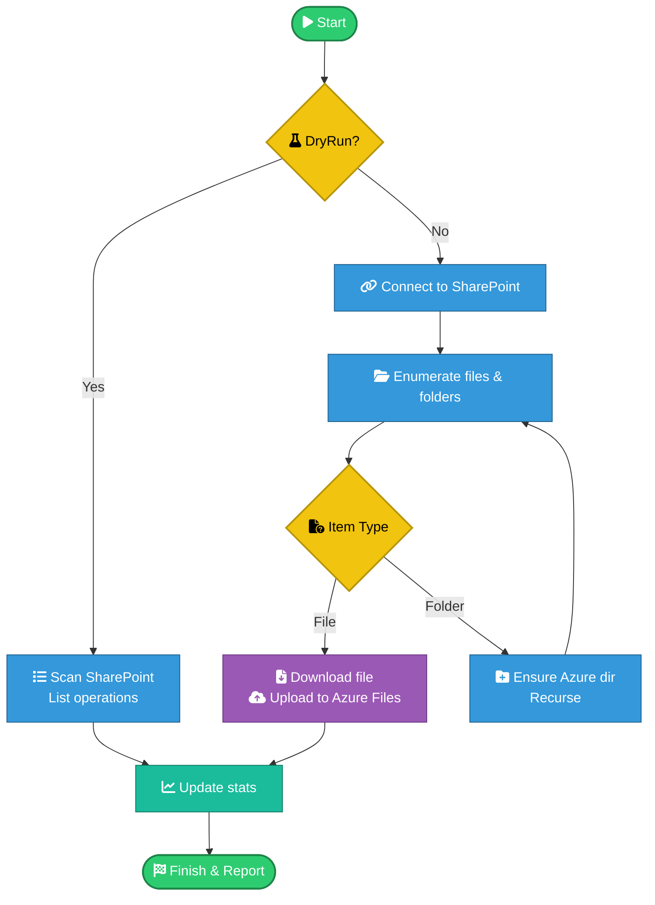

**Summary:** This PowerShell script copies files and folders from a SharePoint site into an Azure Files share. It supports a `-DryRun` mode to preview the operations without making changes. The script enumerates folders and files in SharePoint, creates matching directories in Azure Files, downloads files into a temporary location, uploads them into the Azure Files share, and keeps simple statistics about folders and files processed.

## How to run (quick)

1. Save the full script below as `Copy-SharePoint-to-AzureFiles.ps1`.
2. Edit the Configuration variables near the top of the script (storage account, file share, client ID, etc.).
3. Test with a dry run:

```powershell
powershell -ExecutionPolicy Bypass -File .\Copy-SharePoint-to-AzureFiles.ps1 -DryRun
```

4. When the dry run looks good, run the real copy:

```powershell
powershell -ExecutionPolicy Bypass -File .\Copy-SharePoint-to-AzureFiles.ps1
```




## Full script (copy & paste) — PowerShell


```powershell
<#
.SYNOPSIS
    Copy files from SharePoint site to Azure Files with automatic folder creation
.PARAMETER DryRun
    When specified, the script will only list what would be copied without actually copying anything
.EXAMPLE
    .\Copy-SharePoint-to-AzureFiles.ps1 -DryRun
    Run in dry run mode to preview all operations
.EXAMPLE
    .\Copy-SharePoint-to-AzureFiles.ps1
    Execute the actual copy operation
#>

param(
    [switch]$DryRun
)

# Global statistics
$script:Stats = @{
    FoldersToCreate = 0
    FilesToCopy = 0
    TotalSize = 0
    FoldersList = @()
    FilesList = @()
}

# Configuration - SharePoint Source
$SourceSiteUrl = "https://xxxx.sharepoint.com/sites/xxxx"
$ClientId = "xxxxxxxx-xxxxx-xxxx"
$UseInteractiveLogin = $true # Set to $true to use Interactive login (recommended for Global Admin)
$SourceLibrary = "" # Empty - folders are at site root level
$SourceRootFolder = "" # Empty because the site URL already points to folder_structure
$SubFolders = @("xxxxx", "xxxxx", "xxxx", "xxxxx", "xxxxx")

# Configuration - Azure Files Destination
$StorageAccountName = "xx"  # Change this
$FileShareName = "xx"            # Change this
$StorageAccountKey = "xxx"     # Change this or use connection string
$DestinationRootFolder = "xxxxx" # Root folder in Azure Files

# Temporary download location
$TempDownloadPath = "$env:TEMP\SharePointToAzureFiles"

# Function to ensure Azure Files directory exists
function Initialize-AzureFilesDirectory {
    param(
        [Parameter(Mandatory = $true)]
        [string]$DirectoryPath,
        [Parameter(Mandatory = $true)]
        $Context,
        [switch]$DryRun
    )
    
    if ($DryRun) {
        Write-Host "[DRY RUN] Would check/create directory: $DirectoryPath" -ForegroundColor Cyan
        return
    }
    
    $pathParts = $DirectoryPath.Trim('/').Split('/')
    $currentPath = ""
    
    foreach ($part in $pathParts) {
        if ($currentPath -eq "") {
            $currentPath = $part
        } else {
            $currentPath = "$currentPath/$part"
        }
        
        # Check if directory exists
        $dir = Get-AzStorageFile -ShareName $FileShareName -Path $currentPath -Context $Context -ErrorAction SilentlyContinue
        
        if ($null -eq $dir) {
            Write-Host "Creating directory: $currentPath" -ForegroundColor Yellow
            try {
                $parentPath = if ($currentPath.Contains('/')) {
                    $currentPath.Substring(0, $currentPath.LastIndexOf('/'))
                } else {
                    $null
                }
                
                if ($parentPath) {
                    New-AzStorageDirectory -ShareName $FileShareName -Path $currentPath -Context $Context -ErrorAction Stop | Out-Null
                } else {
                    New-AzStorageDirectory -ShareName $FileShareName -Path $part -Context $Context -ErrorAction Stop | Out-Null
                }
                
                Write-Host "Created directory: $currentPath" -ForegroundColor Green
            }
            catch {
                Write-Host "Error creating directory $currentPath : $_" -ForegroundColor Red
            }
        }
    }
}

# Function to download and upload files recursively
function Copy-FilesRecursively {
    param(
        [Parameter(Mandatory = $true)]
        [string]$SourcePath,
        [Parameter(Mandatory = $true)]
        [string]$DestinationPath,
        [Parameter(Mandatory = $false)]
        $AzureContext,
        [switch]$DryRun
    )
    
    if ($DryRun) {
        Write-Host "`n[DRY RUN] Scanning folder: $SourcePath" -ForegroundColor Magenta
    } else {
        Write-Host "`nProcessing folder: $SourcePath" -ForegroundColor Magenta
    }
    
    # Debug: Show the exact path being accessed
    $fullPath = if ($SourceLibrary -eq "") { $SourcePath } else { "$SourceLibrary/$SourcePath" }
    Write-Host "Debug: Attempting to access: $fullPath" -ForegroundColor Gray
    
    # Get all items in the current folder from SharePoint
    try {
        if ($SourceLibrary -eq "") {
            $items = Get-PnPFolderItem -FolderSiteRelativeUrl $SourcePath -ItemType All -ErrorAction Stop
        } else {
            $items = Get-PnPFolderItem -FolderSiteRelativeUrl "$SourceLibrary/$SourcePath" -ItemType All -ErrorAction Stop
        }
    }
    catch {
        Write-Host "Error accessing folder $SourcePath : $($_.Exception.Message)" -ForegroundColor Red
        return
    }
    
    if ($null -eq $items) {
        Write-Host "No items found in: $SourcePath" -ForegroundColor Yellow
        return
    }
    
    # Process files
    foreach ($file in $items | Where-Object { $_.GetType().Name -eq "File" }) {
        $fileSize = [math]::Round($file.Length / 1MB, 2)
        
        if ($DryRun) {
            Write-Host "[DRY RUN] Would copy file: $($file.Name) (Size: $fileSize MB)" -ForegroundColor White
            $script:Stats.FilesToCopy++
            $script:Stats.TotalSize += $file.Length
            $script:Stats.FilesList += [PSCustomObject]@{
                Name = $file.Name
                Source = "$SourcePath/$($file.Name)"
                Destination = "$DestinationPath/$($file.Name)"
                Size = $fileSize
            }
        } else {
            Write-Host "Copying file: $($file.Name) (Size: $fileSize MB)" -ForegroundColor White
            
            try {
                # Download file from SharePoint to temp location
                $tempFilePath = Join-Path $TempDownloadPath $file.Name
                $fileUrl = if ($SourceLibrary -eq "") { "$SourcePath/$($file.Name)" } else { "$SourceLibrary/$SourcePath/$($file.Name)" }
                Get-PnPFile -Url $fileUrl -AsFile -Path $TempDownloadPath -Filename $file.Name -Force -ErrorAction Stop | Out-Null
                
                # Upload to Azure Files
                Set-AzStorageFileContent -ShareName $FileShareName -Source $tempFilePath -Path "$DestinationPath/$($file.Name)" -Context $AzureContext -Force -ErrorAction Stop | Out-Null
                
                # Clean up temp file
                Remove-Item $tempFilePath -Force -ErrorAction SilentlyContinue
                
                Write-Host "Successfully copied: $($file.Name)" -ForegroundColor Green
            }
            catch {
                Write-Host "Error copying file $($file.Name): $_" -ForegroundColor Red
            }
        }
    }
    
    # Process subfolders recursively
    foreach ($folder in $items | Where-Object { $_.GetType().Name -eq "Folder" }) {
        $newSourcePath = "$SourcePath/$($folder.Name)"
        $newDestinationPath = "$DestinationPath/$($folder.Name)"
        
        if (-not $DryRun) {
            # Ensure Azure Files directory exists
            Initialize-AzureFilesDirectory -DirectoryPath $newDestinationPath -Context $AzureContext
        } else {
            $script:Stats.FoldersToCreate++
            if ($newDestinationPath -notin $script:Stats.FoldersList) {
                $script:Stats.FoldersList += $newDestinationPath
            }
        }
        
        Copy-FilesRecursively -SourcePath $newSourcePath -DestinationPath $newDestinationPath -AzureContext $AzureContext -DryRun:$DryRun
    }
}

# Main script execution
try {
    if ($DryRun) {
        Write-Host "`n========================================" -ForegroundColor Yellow
        Write-Host "DRY RUN MODE - No changes will be made" -ForegroundColor Yellow
        Write-Host "========================================`n" -ForegroundColor Yellow
    }
    
    Write-Host "Starting copy process..." -ForegroundColor Cyan
    Write-Host "Source: $SourceSiteUrl" -ForegroundColor Cyan
    Write-Host "Destination: Azure Files - $StorageAccountName/$FileShareName" -ForegroundColor Cyan
    
    # Connect to SharePoint
    Write-Host "`nConnecting to SharePoint source site..." -ForegroundColor Yellow
    Write-Host "A browser window will open for authentication..." -ForegroundColor Cyan
    try {
        if ($UseInteractiveLogin) {
            # Use Interactive login (browser-based authentication)
            Connect-PnPOnline -Url $SourceSiteUrl -ClientId $ClientId -ErrorAction Stop
        } else {
            Connect-PnPOnline -Url $SourceSiteUrl -ClientId $ClientId -ErrorAction Stop
        }
        Write-Host "Connected to SharePoint successfully" -ForegroundColor Green
    }
    catch {
        Write-Host "Failed to connect to SharePoint: $($_.Exception.Message)" -ForegroundColor Red
        Write-Host "Make sure pop-ups are allowed in your browser" -ForegroundColor Yellow
        throw
    }
    
    # Connect to Azure Storage (only for actual copy, not dry run)
    if (-not $DryRun) {
        Write-Host "`nConnecting to Azure Storage..." -ForegroundColor Yellow
        $azureContext = New-AzStorageContext -StorageAccountName $StorageAccountName -StorageAccountKey $StorageAccountKey
        Write-Host "Connected to Azure Storage successfully" -ForegroundColor Green
        
        # Ensure temp download directory exists
        if (-not (Test-Path $TempDownloadPath)) {
            New-Item -ItemType Directory -Path $TempDownloadPath -Force | Out-Null
        }
    } else {
        $azureContext = $null
    }
    
    # Process each subfolder
    foreach ($subFolder in $SubFolders) {
        Write-Host "`n========================================" -ForegroundColor Cyan
        Write-Host "Processing subfolder: $subFolder" -ForegroundColor Cyan
        Write-Host "========================================" -ForegroundColor Cyan
        
        # Build paths
        $sourcePath = if ($SourceRootFolder -eq "") { $subFolder } else { "$SourceRootFolder/$subFolder" }
        $destinationPath = if ($DestinationRootFolder -eq "") { $subFolder } else { "$DestinationRootFolder/$subFolder" }
        
        # Ensure root destination folder exists (only for non-dry run)
        if (-not $DryRun) {
            Initialize-AzureFilesDirectory -DirectoryPath $destinationPath -Context $azureContext
        }
        
        # Start recursive processing
        if ($DryRun) {
            Copy-FilesRecursively -SourcePath $sourcePath -DestinationPath $destinationPath -AzureContext $azureContext -DryRun
        } else {
            Copy-FilesRecursively -SourcePath $sourcePath -DestinationPath $destinationPath -AzureContext $azureContext
        }
    }
    
    if ($DryRun) {
        # Display summary statistics
        Write-Host "`n========================================" -ForegroundColor Yellow
        Write-Host "DRY RUN SUMMARY" -ForegroundColor Yellow
        Write-Host "========================================" -ForegroundColor Yellow
        Write-Host "Total folders to create: $($script:Stats.FoldersToCreate)" -ForegroundColor Cyan
        Write-Host "Total files to copy: $($script:Stats.FilesToCopy)" -ForegroundColor Cyan
        $totalSizeGB = [math]::Round($script:Stats.TotalSize / 1GB, 2)
        $totalSizeMB = [math]::Round($script:Stats.TotalSize / 1MB, 2)
        Write-Host "Total size to copy: $totalSizeMB MB ($totalSizeGB GB)" -ForegroundColor Cyan
        
        Write-Host "`n--- Folders to be created ---" -ForegroundColor Yellow
        if ($script:Stats.FoldersList.Count -gt 0) {
            $script:Stats.FoldersList | ForEach-Object { Write-Host "  + $_" -ForegroundColor DarkYellow }
        } else {
            Write-Host "  (No new folders needed)" -ForegroundColor Gray
        }
        
        Write-Host "`n--- Files to be copied ---" -ForegroundColor Yellow
        if ($script:Stats.FilesList.Count -gt 0) {
            $script:Stats.FilesList | ForEach-Object { 
                Write-Host "  $($_.Name)" -ForegroundColor White
                Write-Host "    From: $($_.Source)" -ForegroundColor Gray
                Write-Host "    To:   $($_.Destination)" -ForegroundColor Gray
                Write-Host "    Size: $($_.Size) MB" -ForegroundColor Gray
            }
        } else {
            Write-Host "  (No files to copy)" -ForegroundColor Gray
        }
        
        Write-Host "`n========================================" -ForegroundColor Green
        Write-Host "DRY RUN COMPLETED - Ready to execute" -ForegroundColor Green
        Write-Host "Run without -DryRun to perform actual copy" -ForegroundColor Green
        Write-Host "========================================" -ForegroundColor Green
    } else {
        # Clean up temp directory
        if (Test-Path $TempDownloadPath) {
            Remove-Item $TempDownloadPath -Recurse -Force -ErrorAction SilentlyContinue
        }
        
        Write-Host "`n========================================" -ForegroundColor Green
        Write-Host "Copy process completed!" -ForegroundColor Green
        Write-Host "========================================" -ForegroundColor Green
    }
}
catch {
    Write-Host "Error in main execution: $_" -ForegroundColor Red
    Write-Host $_.Exception.Message -ForegroundColor Red
}
finally {
    Disconnect-PnPOnline -ErrorAction SilentlyContinue
}
